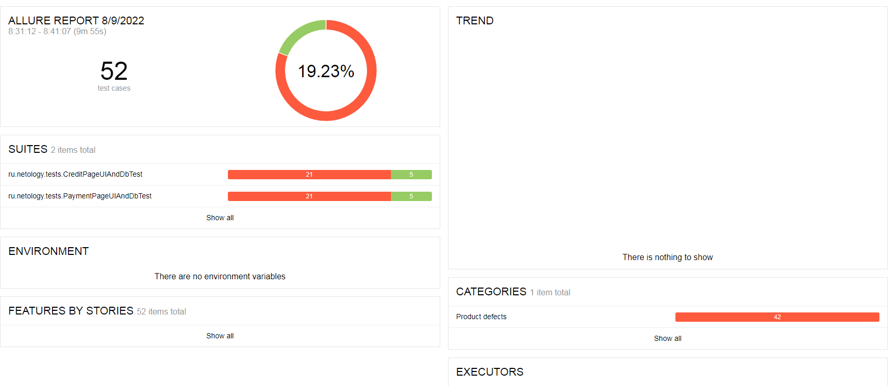

## Отчет по итогам тестирования
### Краткое описание
В ходе работы над проектом было проведено тестирование веб-сервиса "Путешествие дня", которой представляет из себя комплексный сервис, взаимодействующий с СУБД и API Банка.

Первоначально было проведено ручное тестирование. 

На втором этапе были написаны автотесты, и было проведено автоматизированное тестирование сервиса с использованием всех инструментов, указанных в [Плане автоматизации тестирования](https://github.com/Vladislav0306/aqa-diplom/blob/master/documentation/Plan.md). 

Тесты включали в себя как позитивные, так и негативные сценарии покупки путешествия. Были проведены тесты UI, тесты БД. 

Тестирование было проведено для PostgreSQL.
### Количество тест-кейсов - 52, из них
- успешных - 10
- неуспешных - 42

### Общие рекомендации
- Создать документацию к приложению 
- Исправить ошибку в названии города на главной странице
- В поле "Владелец" установить ограничение символов, а также убрать возможность отправки формы с одним именем/фамилией
- В поле "Владелец" убрать возможность введения цифр
- В поле "Месяц" убрать возможность введения значения "00"
- При вводе невалидного номера карты и отправки формы убрать двойное всплывающее окно, оставить только окно с сообщением об ошибке
- Исправить надписи под полями при вводе невалидных данных на более логичные(см. тесты)

